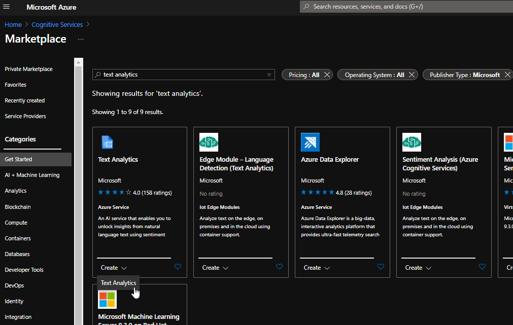
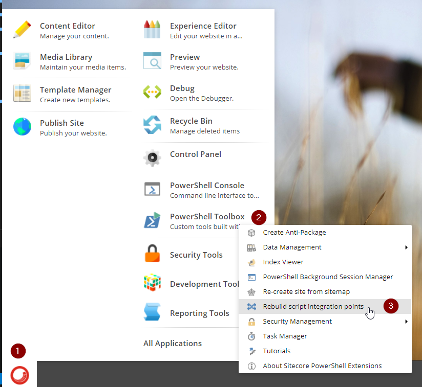
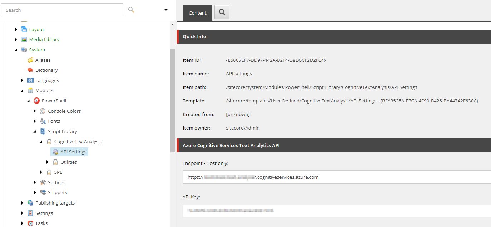
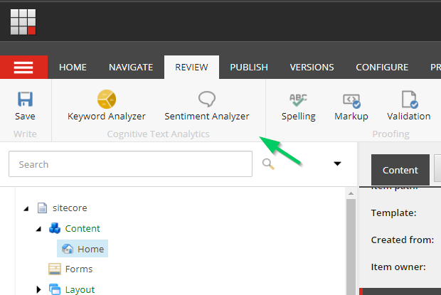
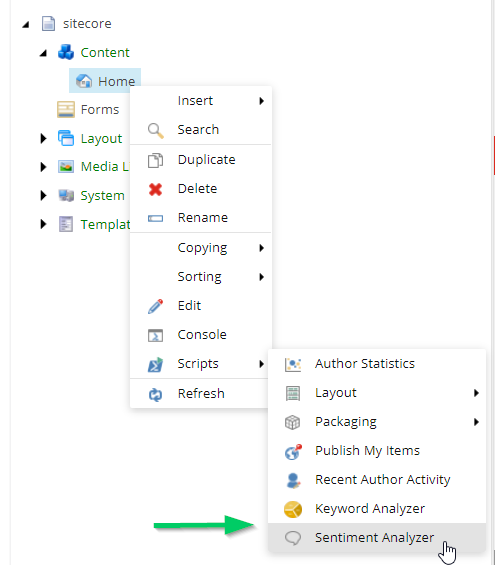
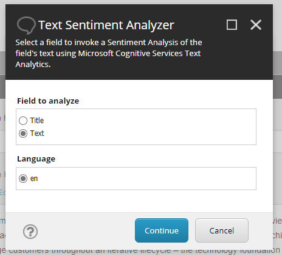
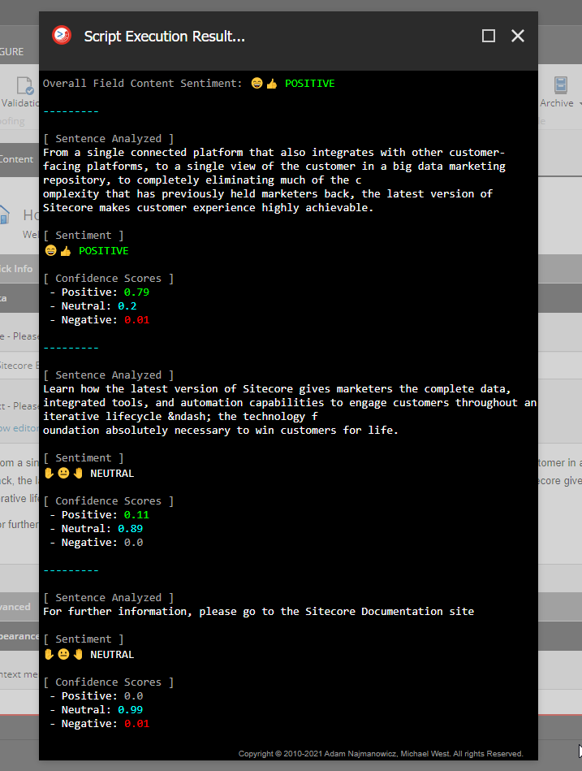
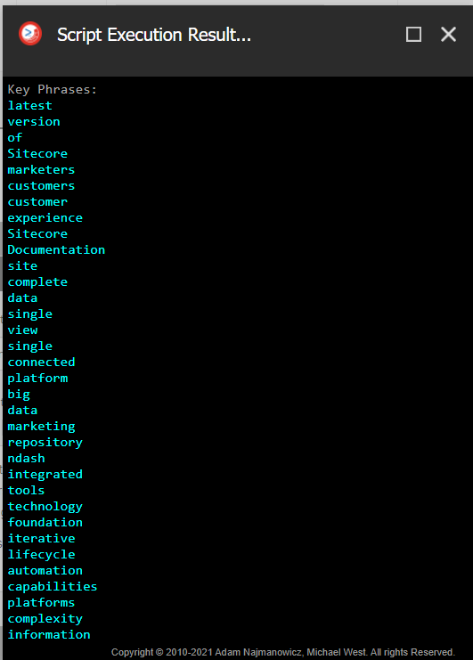

# BLAMstack 2021 Hackathon Submission Entry

- [BLAMstack 2021 Hackathon Submission Entry](#blamstack-2021-hackathon-submission-entry)
  - [🥇 Team name](#🥇-team-name)
  - [📂 Category](#📂-category)
  - [📜 Description](#📜-description)
  - [📹 Video Demo](#📹-video-demo)
  - [✅ Pre-requisites and Dependencies](#✅-pre-requisites-and-dependencies)
  - [👩‍🏫 Installation instructions](#👩‍🏫-installation-instructions)
    - [⚙ Configuration](#⚙-configuration)
      - [API Setting Item](#api-setting-item)
      - [Cognitive Service](#cognitive-service)
  - [🚀 Usage instructions](#🚀-usage-instructions)
    - [Utility Visibility Criteria](#utility-visibility-criteria)
    - [Utility Locations](#utility-locations)
    - [Sentiment Analyzer](#sentiment-analyzer)
    - [Keyword Analyzer](#keyword-analyzer)
  - [📝 Comments](#📝-comments)

 

## 🥇 Team name
- 2021-BLAMstack
  - [@GabeStreza](https://www.twitter.com/GabeStreza)

 

## 📂 Category
- Best use of SPE to help Content authors and Marketers

 

## 📜 Description

As Content Authors and Marketers craft content, one phrase or word could unexpected change the intended message's **sentiment** and perception to a user reading the content.  That's why **sentiment analysis** is so important.

---

*"Sentiment analysis (also known as opinion mining or emotion AI) refers to the use of natural language processing, text analysis, computational linguistics, and biometrics to systematically identify, extract, quantify, and study affective states and subjective information."* - [Sentiment analysis - Wikipedia](https://en.wikipedia.org/wiki/Sentiment_analysis)

---

In addition to sentiment analysis, ensuring the right keywords are present in a site's meta tags are still an important factor in SEO rankings

---

*"Keywords are ideas and topics that define what your content is about. In terms of SEO, they're the words and phrases that searchers enter into search engines, also called "search queries." If you boil everything on your page — all the images, video, copy, etc. — down to simple words and phrases, those are your primary keywords."* - [MOZ](https://moz.com/learn/seo/what-are-keywords)

---

Driven by the [Microsoft Azure Cognitive Services Text Analytics API](https://azure.microsoft.com/en-us/services/cognitive-services/text-analytics/), this `Sitecore PowerShell Extensions` module comes packaged with two utilities:

1. Sentiment Analyzer

   - Analyze the **sentiment** of field content directly in Sitecore.

   - The `Sentiment Analyzer` utility gives Content Authors the ability to run an analysis of a given field's content which returns an **overall sentiment score**, as well as a **sentence-by-sentence breakdown** of each sentence's **sentiment score** and corresponding **confidence scores**.

   - The results are displayed using a `Show-Result` modal and rendered in an easy-to-digest format.

2. Keyword Analyzer

   - Analyze a field's content to **extract** critical **keywords**/phrases.
   - The `Keyword Analyzer` utility gives Content Authors the ability to run an analysis of a given field's content which returns **a list of extracted keywords** which can then be used to manually populate a meta keywords field, for example. 

   - The results are displayed using a `Show-Result` modal and rendered in an easy-to-copy format.

 
<a href="#">Back to top</a>
 

## 📹 Video Demo

<iframe width="600" height="500" src="https://www.youtube.com/embed/l5wV0TXfC8k" frameborder="0" allow="accelerometer; autoplay; clipboard-write; encrypted-media; gyroscope; picture-in-picture" allowfullscreen></iframe>

[https://www.youtube.com/watch?v=l5wV0TXfC8k](https://www.youtube.com/watch?v=l5wV0TXfC8k)

 
<a href="#">Back to top</a>
 

## ✅ Pre-requisites and Dependencies

- An active [Microsoft Azure Cognitive Services Text Analytics API](https://azure.microsoft.com/en-us/services/cognitive-services/text-analytics/) is required. **However, the API keys that are embedded in the scripts are good for 30 days** (should be enough time for Hackathon judgement). 

  - If you want to create your own free 30-day tier, you'll need to provision a `Text Analytics` Cognitive Service in Azure before entering the values into the `API Settings` item:

    

 
<a href="#">Back to top</a>
 

## 👩‍🏫 Installation Instructions

The installation of this module relies on a basic Sitecore Package installtion and rebuilding the [integration points](https://doc.sitecorepowershell.com/modules/integration-points) in SPE.

1. Start docker environment using `.\Start-Hackathon.ps1` (this or any existing Sitecore environment will work, too)

2. Log into Sitecore Client and use the `Sitecore Installation` wizard to install the ['CognitiveTextAnalysis_SPE.zip' package](SPE_Module_Installation_Packages/CognitiveTextAnalysis_SPE.zip)

3. From the `Sitecore Desktop`, click the `Start Menu`, then click the `PowerShell Toolbox`, and select `Rebuild script integration points`

    

 

> **Optional:** the [BLAMstack_DemoContent.zip](SPE_Module_Installation_Packages/BLAMstack_DemoContent.zip) package can also be installed to use the same content used in the video demo.

 

### ⚙ Configuration

This module will function OOB **without any additional configuration** for ~30 days (due to expire ~04/02/2021) from the time of this submission since the `API Settings` item that gets installed with the package already includes active `Endpoint` and `API Key` values. 

 

#### API Setting Item

| Name | Path | ID |
|---|---|---|
| `API Settings` | `/sitecore/system/Modules/PowerShell/Script Library/CognitiveTextAnalysis/API Settings` | `{E5006EF7-DD97-442A-B2F4-D8D6CF2D2FC4}` |

 
<a href="#">Back to top</a>
 

## 🚀 Usage instructions

### Utility Visibility Criteria 

The `Sentiment Analyzer` and `Keyword Analyzer` utilities are accessible on any item under `/sitecore/content` where the item contains any of the following field types:

1. `Single-Line Text`
2. `Multi-Line Text`
3. `Rich Text`

If the above criteria is not met, the utilities **will not visible**. 

 

### Utility Locations

Both utilities are accessible in two locations:

1. The `Ribbon` in the `Review` tab under a new category called `Cognitive Text Analytics`:

    

2. Right-clicking on an applicable item and clicking `Scripts`:

    

 

### Sentiment Analyzer

1. Start the `Sentiment Analyzer` from either the `Ribbon` or the `Context Menu`

2. Select a field and the language you'd like analyzed and click `Continue`. 
    > These options are dynamically generated based on the item. If an item has multiple-language versions, those options will render allowing the author to select the language to analyze.  

    

3. Review the sentence-by-sentence sentiment analysis breakdown:

    

 

### Keyword Analyzer
1. Start the `Keyword Analyzer` from either the `Ribbon` or the `Context Menu`

2. Select a field and the language you'd like analyzed and click `Continue`. 
    > These options are dynamically generated based on the item. If an item has multiple-language versions, those options will render allowing the author to select the language to analyze.  

    

3. Review sentence-by-sentence sentiment analysis:

    

 
<a href="#">Back to top</a>
 

## 📝 Comments

I intended to include an [Experience Button](https://doc.sitecorepowershell.com/modules/integration-points/page-editor#experience-button) integration point to allow both utlities to be accessed using Experience Editor, however, SPE doesn't seem to be picking up Page Editor integration points by default, so it was abandoned.  🤷‍♂️